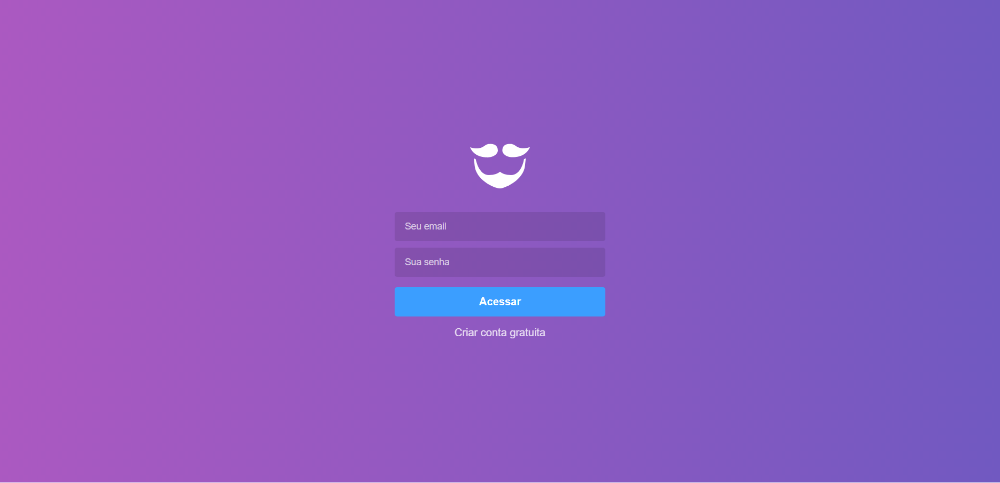
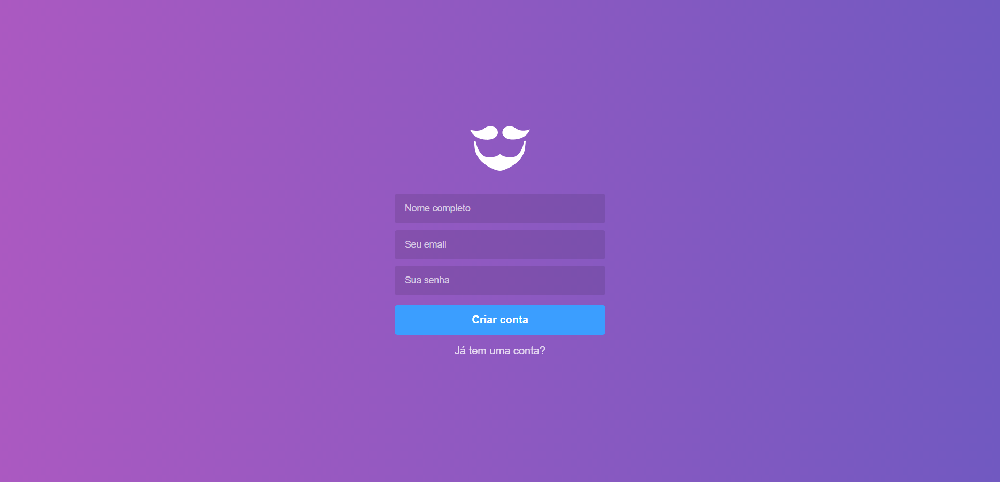
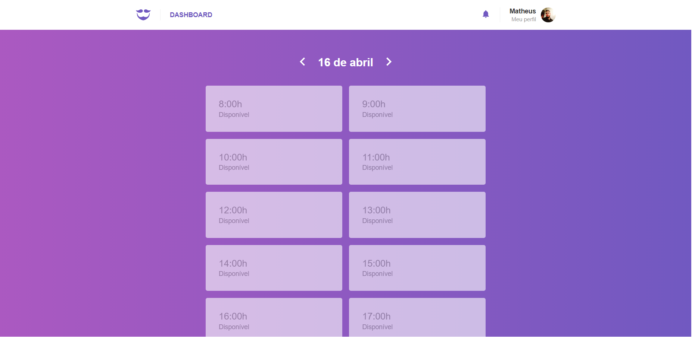
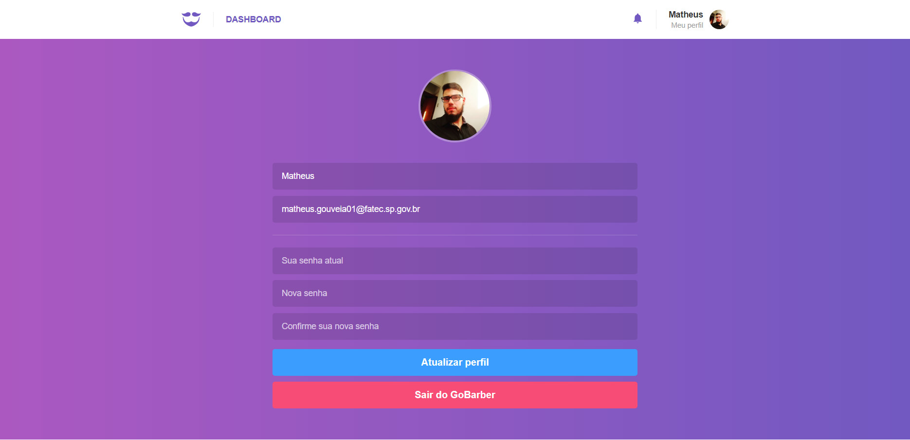

# GoBarber

### Aplicação desenvolvida durante o Bootcamp Gostack 10 utilizando as tecnologias:

-   ReactJS

-   Redux

-   Redux Saga

-   Axios

-   Date fns

-   Styled components

-   Yup

## [Repositório do servidor](https://github.com/maatheusgouveia/gobarber-backend)

## Login

## Cadastro de usuário

## Dashboard

## Perfil do usuário

